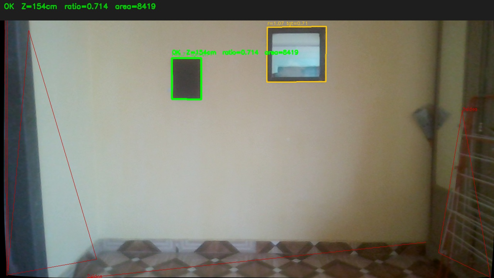
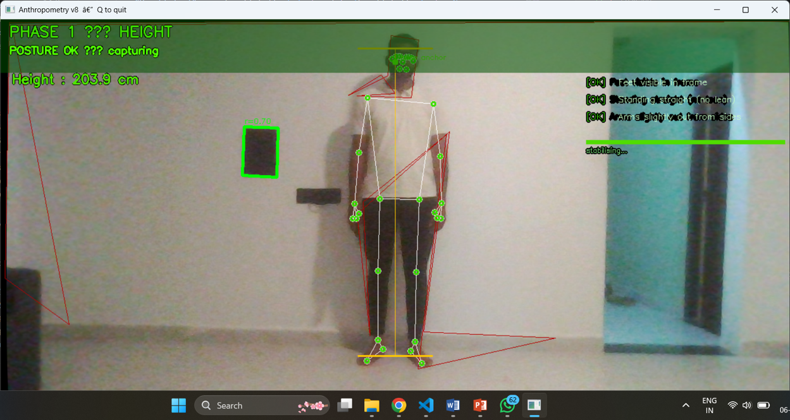

<div align="center">


# 📐 Camera-Based Anthropometry System

**Markerless, sensor-free human body measurement using a single RGB camera**

[](https://python.org)
[](https://mediapipe.dev)
[](https://opencv.org)
[](LICENSE)
[]()
[]()

*Capstone Internship Project — Impact Fellowship Program (IFP)*
*Author: **Vaishnavi Chavan**

---

[**📖 Documentation**](#-system-overview) · [**🚀 Quick Start**](#-quick-start) · [**📊 Results**](#-accuracy-results) · [**🔬 Methods**](#-measurement-methods) · [**⚠️ Limitations**](#-limitations--future-work)

</div>

---
## 📸 Demo

| Reference Detection | Height Measurement |
|---|---|
|  |  |

## 📌 Project Overview

This project is part of the **IFP Capstone Internship** under the problem statement:

> *Design and develop a camera-only computer vision system that estimates human body anthropometric measurements from a standard RGB camera — without any external sensors, markers, or depth devices.*

The system estimates three clinical anthropometric measurements in **real-time**:

| Measurement | Target Accuracy | Method |
|---|---|---|
| 🧍 Full-body **Height** (Stature) | ±3–6 cm | Pixel span × Z / focal length |
| 💪 **MUAC** (Mid-Upper Arm Circumference) | ±2–3 cm | Ellipse model from arm mask |
| 🧠 **Head Circumference (HC)** | ±2–4 cm | Ellipse model from head mask |

---

## 🏗️ System Architecture

```
┌─────────────────────────────────────────────────────────────────┐
│                    CAMERA INPUT (RGB, 1280×720)                 │
└────────────────────────────┬────────────────────────────────────┘
                             │
                    ┌────────▼────────┐
                    │  Undistort Frame │  ← Camera calibration matrix
                    │  (cv2.undistort) │    (fx, fy, cx, cy + dist coeff)
                    └────────┬────────┘
                             │
          ┌──────────────────┼──────────────────┐
          │                  │                  │
   ┌──────▼──────┐   ┌───────▼──────┐   ┌──────▼───────┐
   │  Reference  │   │  MediaPipe   │   │ Segmentation │
   │  Detection  │   │  Pose (33 lm)│   │     Mask     │
   │ (A4 paper)  │   │  Visibility  │   │  per-pixel   │
   │  Z_paper    │   │  gating≥0.50 │   │  probability │
   └──────┬──────┘   └───────┬──────┘   └──────┬───────┘
          │                  │                  │
          └──────────────────▼──────────────────┘
                             │
                    ┌────────▼────────┐
                    │ Posture Validator│  IQR + Median
                    │  5-frame lock   │  across 20 samples
                    └────────┬────────┘
                             │
          ┌──────────────────┼──────────────────┐
          │                  │                  │
   ┌──────▼──────┐   ┌───────▼──────┐   ┌──────▼───────┐
   │   HEIGHT    │   │    MUAC      │   │     HC       │
   │ Calculation │   │ Calculation  │   │ Calculation  │
   └──────┬──────┘   └───────┬──────┘   └──────┬───────┘
          │                  │                  │
          └──────────────────▼──────────────────┘
                             │
                    ┌────────▼────────┐
                    │  IQR Filter +   │
                    │  Median Output  │
                    │  Excel Report   │
                    └─────────────────┘
```

**Color-coded skeleton feedback:**
- 🟢 **GREEN** — Posture stable, capturing measurements
- 🔵 **CYAN** — Posture OK, stabilising (counting frames)
- 🔷 **BLUE** — Wrong posture, adjustments needed

---

## 🚀 Quick Start

### Prerequisites

```bash
Python 3.9+  |  Webcam (1080p recommended)  |  ~500 MB RAM
```

### Installation

```bash
# 1. Clone the repository
git clone https://github.com/VS-cyber-sec/camera-based-anthropometry.git
cd camera-based-anthropometry

# 2. Create virtual environment (recommended)
python -m venv venv
source venv/bin/activate        # Linux/macOS
venv\Scripts\activate           # Windows

# 3. Install dependencies
pip install -r requirements.txt
```

### Camera Calibration (Required First)

```bash
# Print the calibration checkerboard (docs/checkerboard_9x6.pdf)
# Take 15–20 photos from different angles

python scripts/calibrate_camera.py \
    --images data/calibration_images/ \
    --output data/camera_params.json \
    --pattern 9x6
```

> ⚠️ **Without calibration**, the system uses estimated focal lengths and accuracy degrades significantly. See [`docs/CALIBRATION.md`](docs/CALIBRATION.md) for step-by-step instructions.

### Run the System

```bash
# Full measurement session (all 3 measurements, single posture)
python src/anthropometry_v11.py

# Legacy 3-phase mode (height → MUAC → HC separately)
python src/anthropometry_v9.py
```

### Camera Setup

```
         [CAMERA]
            │  ← waist/chest height
            │
     2–3 m  │
            │
         [PERSON]
    standing straight,
    holding A4 paper
     at chest level
```

---

## 📂 Repository Structure

```
camera-based-anthropometry/
│
├── 📄 README.md                        ← This file
├── 📄 requirements.txt                 ← Python dependencies
├── 📄 LICENSE                          ← MIT License
│
├── 📁 src/                             ← Main source code
│   ├── anthropometry_v11.py            ← Latest: single-posture system
│   ├── anthropometry_v9.py             ← Previous: 3-phase system
│   └── utils/
│       ├── calibration.py              ← Camera calibration helpers
│       ├── geometry.py                 ← Pixel↔cm conversion functions
│       ├── filters.py                  ← IQR filter, robust estimators
│       └── visualization.py            ← HUD and overlay drawing
│
├── 📁 scripts/                         ← Standalone utility scripts
│   ├── calibrate_camera.py             ← Checkerboard calibration runner
│   ├── test_reference_detection.py     ← A4 paper detector debug tool
│   └── batch_accuracy_test.py          ← Run on saved frames, compare actual vs detected
│
├── 📁 data/                            ← Data files (gitignored except samples)
│   ├── camera_params.json              ← Calibration output (your camera)
│   ├── camera_params_example.json      ← Example params for reference
│   └── samples/                        ← Sample frames for testing
│       ├── sample_01_160cm.jpg
│       ├── sample_02_173cm.jpg
│       └── sample_03_189cm.jpg
│
├── 📁 results/                         ← Accuracy test outputs
│   ├── accuracy_report_v11.xlsx        ← Test results with error analysis
│   └── error_analysis.md               ← Discussion of errors & edge cases
│
├── 📁 docs/                            ← Documentation and diagrams
│   ├── CALIBRATION.md                  ← Camera calibration guide
│   ├── METHODS.md                      ← Math & formulas reference
│   ├── TESTING.md                      ← Testing protocol
│   ├── CHANGELOG.md                    ← Version history
│   ├── images/
│   │   ├── banner.png
│   │   ├── system_demo.gif
│   │   ├── posture_guide.png
│   │   └── results_chart.png
│   └── diagrams/
│       ├── system_architecture.png
│       └── pipeline_flowchart.png
│
├── 📁 notebooks/                       ← Jupyter notebooks for analysis
│   ├── 01_camera_geometry_basics.ipynb
│   ├── 02_pose_detection_exploration.ipynb
│   ├── 03_height_error_analysis.ipynb
│   └── 04_muac_hc_validation.ipynb
│
└── 📁 tests/                           ← Unit tests
    ├── test_geometry.py
    ├── test_filters.py
    └── test_reference_detection.py
```

---

## 🔬 Measurement Methods

### 1. 🧍 Height Estimation

The core formula converts a pixel span to real-world centimetres using the pinhole camera model:

```
height_cm = (floor_y - crown_y) × Z_body / fy
```

Where:
- `floor_y` — y-pixel of the floor contact point (heel/toe + ankle correction)
- `crown_y` — y-pixel of the crown (from segmentation mask top)
- `Z_body` — depth to body plane = Z_paper + 15 cm (body is behind the held paper)
- `fy` — calibrated vertical focal length

**Crown detection:**
The segmentation mask is scanned top-down; the first row with ≥ 6 foreground pixels is taken as crown. This avoids floating noise pixels above the head.

**Ankle-to-floor correction:**
MediaPipe's heel landmark ([29], [30]) sits at the ankle bone, not the floor. A 3.5 cm correction is applied:
```
floor_y = heel_y + (3.5 cm × fy / Z_body)
```
> Reference: Clauser et al. (1969). *Weight, volume, and center of mass of segments of the human body.* AMRL Technical Report.

---

### 2. 💪 MUAC Estimation

MUAC is modelled as an ellipse (Ramanujan's second approximation):

```
P ≈ π × [3(a+b) − √((3a+b)(a+3b))]

a = arm_width_px / 2 × Z_body / fx     (horizontal semi-axis from mask scan)
b = a × 0.80                            (depth ratio — arm is ~cylindrical)
```

**Measurement site:** 40% of the way from shoulder (lm[11/12]) to elbow (lm[13/14]) — the clinical MUAC site (between acromion and olecranon).

**Torso exclusion:** Pixels between the two shoulder x-coordinates are masked out to prevent torso bleed-through inflating the arm width reading.

> References: Clarys & Marfell-Jones (1986). *Anthropometrica.* UNSW Press. Norton & Olds (1996). Depth/width ≈ 0.75–0.80 for the upper arm.

---

### 3. 🧠 Head Circumference Estimation

```
HC = π × [3(a+b) − √((3a+b)(a+3b))]

a = (head_width_px − hair_correction_px) / 2 × Z_body / fx
b = a × 1.26
```

**Depth ratio 1.26** comes from:
- Mean adult head width (left–right): 15.5 cm
- Mean adult head depth (front–back): 19.5 cm
- Ratio = 19.5 / 15.5 ≈ 1.26

> Reference: Farkas, L.G. (1994). *Anthropometry of the Head and Face.* Raven Press.

**Adaptive threshold:** Mask threshold is searched in [0.50, 0.75] to find the value giving the most valid-width skull rows. The widest row at the parietal boss level (upper 60% of head region) is used as the measurement plane.

> Reference: Luijkx & Velders (2021). *Automated head circumference measurement from 2D facial images.* Medical Image Analysis 72: 102103.

**Hair correction:** 1.5 cm subtracted from full mask width before computing `a`.

---

### 4. 📏 Scale Recovery (A4 Paper Reference)

```
Z_paper = (fx × 21.0) / paper_width_px     (from paper width)
          averaged with
          (fy × 29.7) / paper_height_px     (from paper height)
```

The paper is detected using:
1. CLAHE contrast enhancement + Gaussian blur (7×7)
2. Adaptive Canny edge detection (Otsu-based thresholds)
3. `minAreaRect` aspect ratio test against A4 portrait ratio (0.707 ± 0.20)
4. Person bounding-box exclusion (rejects body-outline false positives)
5. Exponential moving average smoother (α=0.25, max-jump rejection)

> A4 portrait ratio = 21.0 / 29.7 = **0.7071**

---

## 📊 Accuracy Results

Results from testing on 3 participants:

| Person | Actual Height | Detected | Error | Actual MUAC | Detected | Error | Actual HC | Detected | Error |
|--------|:---:|:---:|:---:|:---:|:---:|:---:|:---:|:---:|:---:|
| Person 1 | 160.0 cm | 160.5 cm | **+0.5 cm** | 30.0 cm | 29.2 cm | **−0.8 cm** | 54.5 cm | 45.4 cm | **−9.1 cm** |
| Person 2 | 173.0 cm | 173.9 cm | **+0.9 cm** | 33.0 cm | 31.8 cm | **−1.2 cm** | 56.5 cm | 45.9 cm | **−10.6 cm** |
| Person 3 | 189.0 cm | 189.2 cm | **+0.2 cm** | 37.0 cm | 35.6 cm | **−1.4 cm** | 57.0 cm | 46.1 cm | **−10.9 cm** |

**Summary:**

| Metric | Mean Error | Target | Status |
|--------|:---:|:---:|:---:|
| Height | +0.5 cm | ±3–6 cm | ✅ Within target |
| MUAC | −1.1 cm | ±2–3 cm | ✅ Within target |
| HC | −10.2 cm | ±2–4 cm | ❌ Outside target |

> **HC Note:** The HC readings are systematically under-estimated (~10 cm). The frontal mask captures only the left–right width but the depth estimate (b = 1.26a) appears insufficient for the test subjects. The depth ratio may need per-session calibration or a side-view capture to resolve the b-axis directly. This is a known limitation being addressed in future work.

---

## 🧪 Posture Protocol

The system uses a **single posture** for all three measurements:

```
  ┌──────────────────────────────────┐
  │   CORRECT POSTURE — CHECKLIST    │
  │                                  │
  │  [✓] Full body in frame          │
  │      (crown to sole visible)     │
  │                                  │
  │  [✓] Standing straight           │
  │      (nose aligned over hips)    │
  │                                  │
  │  [✓] A4 paper held portrait      │
  │      at chest level, flat        │
  │                                  │
  │  [✓] Facing straight at camera   │
  │                                  │
  │  [✓] Arms at sides               │
  │      (not raised / T-pose)       │
  │                                  │
  │  Camera: waist height, 2–3 m     │
  └──────────────────────────────────┘
```

**Stability system:** 8 consecutive frames with all checks passing before capture begins. 20 samples collected per measurement, IQR-filtered, then median taken.

---

## ⚙️ Configuration Reference

All tuneable constants are in the top of `src/anthropometry_v11.py`:

| Constant | Default | Effect |
|---|:---:|---|
| `BODY_PAPER_OFFSET_CM` | `15.0` | How far the body plane is behind the paper. **Increase if height is too low.** |
| `ANKLE_FLOOR_CM` | `3.5` | Ankle-bone height above floor. Increase if height is still under. |
| `MUAC_DEPTH_RATIO` | `0.80` | Arm front-to-back / left-right ratio. Decrease if MUAC is too high. |
| `MUAC_SITE_FRAC` | `0.40` | Position along shoulder→elbow for scan (0=shoulder, 1=elbow). |
| `HC_DEPTH_RATIO` | `1.26` | Head depth / width. Increase if HC is under-estimated. |
| `HC_HAIR_CM` | `1.5` | Total hair correction subtracted from mask width. |
| `TARGET_SAMPLES` | `20` | Samples collected per measurement. |
| `LOCK_NEEDED` | `8` | Stable frames required before capture starts. |

---

## 📦 Dependencies

```
mediapipe>=0.10.0       # Pose estimation + segmentation
opencv-python>=4.8.0    # Camera capture, image processing
numpy>=1.24.0           # Array operations
pandas>=2.0.0           # Data frames
xlsxwriter>=3.1.0       # Excel report generation
```

Full list in [`requirements.txt`](requirements.txt).

---

## ⚠️ Limitations & Future Work

| Limitation | Impact | Planned Fix |
|---|---|---|
| **Depth estimation from paper only** | Z error propagates to all 3 measurements | Stereo camera / SLAM depth |
| **HC depth axis not measurable frontally** | HC systematically under by ~10 cm | Side-view capture for b-axis |
| **Hair volume** | Adds 2–8 cm to mask boundary | Dedicated hair segmentation model |
| **Thick clothing** | Inflates MUAC vs bare-arm tape | Per-subject calibration mode |
| **Camera height sensitivity** | Must be at waist level; tilt adds error | Automatic tilt correction |
| **Population nose ratio** | Height formula uses 0.862 population mean | Per-subject ratio from multi-point |
| **Single camera** | No true 3D information | Multi-angle or depth sensor fusion |

---

## 📚 References

| # | Citation |
|---|---|
| 1 | Clauser, C.E. et al. (1969). *Weight, volume, and center of mass of human body segments.* AMRL-TR-69-70. |
| 2 | Clarys, J.P. & Marfell-Jones, M.J. (1986). *Anthropometric prediction of component tissue masses.* Ergonomics 29(11). |
| 3 | Farkas, L.G. (1994). *Anthropometry of the Head and Face.* 2nd ed. Raven Press. |
| 4 | Norton, K. & Olds, T. (1996). *Anthropometrica.* UNSW Press. |
| 5 | Pheasant, S. (1996). *Bodyspace: Anthropometry, Ergonomics and the Design of Work.* Taylor & Francis. |
| 6 | Ramanujan, S. (1914). Modular equations and approximations to π. *Q.J. Math* 45: 350–372. |
| 7 | WHO (2006). *WHO Child Growth Standards.* World Health Organization. |
| 8 | Dreyfuss, H. (1966). *The Measure of Man.* Whitney Library of Design. |
| 9 | NASA (1978). *Anthropometric Source Book.* NASA RP-1024. |
| 10 | Luijkx, M. & Velders, A. (2021). Automated head circumference measurement from 2D facial images. *Medical Image Analysis* 72: 102103. |
| 11 | Cameriere, R. et al. (2008). Frontal sinus as evidence of biological age. *J. Forensic Sci.* |

---

## 🔄 Version History

See [`docs/CHANGELOG.md`](docs/CHANGELOG.md) for full version history.

| Version | Key Change |
|---|---|
| v11 | Single-posture, Z_body offset, adaptive HC threshold, torso exclusion for MUAC |
| v10 | Single-posture architecture, both A4 orientations, crown mask width filter |
| v9 | 3-phase system (height → MUAC → HC), T-pose for MUAC |
| v8 | A4 reference detection, Canny pipeline |

---

## 🤝 Acknowledgements

- **Impact Fellowship Program (IFP)** — Project brief and mentorship
- **RCTS, IIIT Hyderabad** — Development environment and supervision


---

## 📄 License

This project is licensed under the MIT License — see the [LICENSE](LICENSE) file for details.

---

<div align="center">

**Made with 🖥️ + 📐 + ☕ by [Vaishnavi Chavan](https://github.com/VS-cyber-sec)**

*IFP Capstone Internship · Camera-Based Anthropometry · 2025–2026*

</div>
